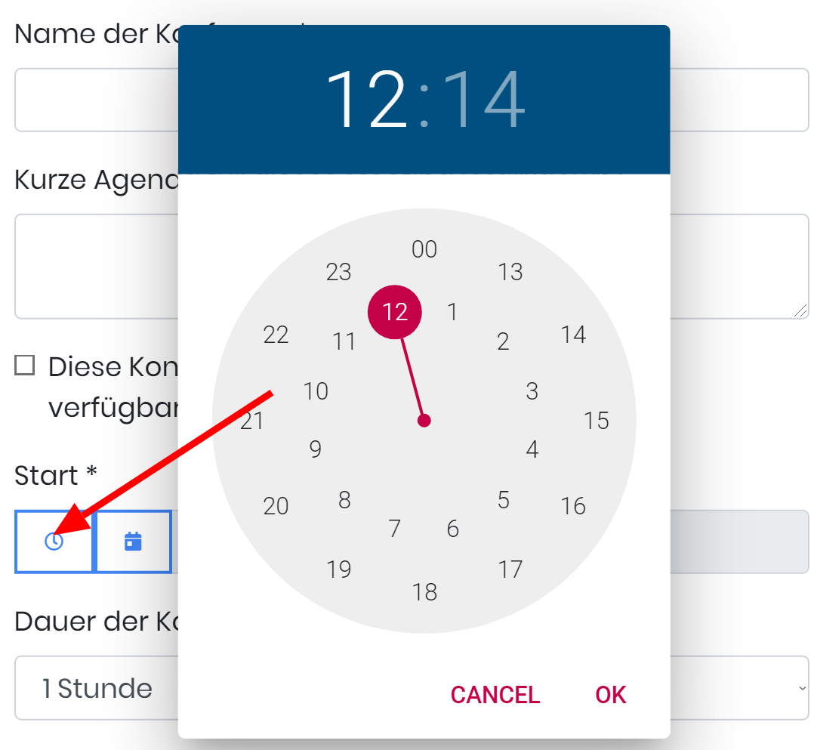

# H2 date Time Picker
Dies ist die Kombination von

https://www.npmjs.com/package/@holema/mdtimepicker
https://www.npmjs.com/package/@holema/datepicker

First the two packages are completly ungoogled, so the Roboto Font was made offline available.
This is needed in Germany to be completle GDPR compliant.

The Package creates a new Input Field.

The Field existing field still stays and will be sand by the form submit to the Server.
The visible Field is only a dummy field.

When klicking the small clock then the timepicker opens

When no Date was selected before, then the date today will be selected.
When clicking the Datefield, then first the datepicker is opend.

After selecting the date, the timepicker opens automaticaly.

Installation:

`npm i @holema/datepicker`

In die haupt CSS:

`@import "~@holema/h2datetimepicker/css/dateTimePicker.css";`

in die Haupt-JS:

`import {initdateTimePicker,cleanDateTimePicker} from '@holema/h2datetimepicker';`

To render a datetime input field as datetimepicker, activate the plugin with:

Input the class or id of the element.

`initdateTimePicker('#schedulePickr')`

To clean the input, enter the original DOM element.
`cleanDateTimePicker(document.getElementById('schedulePickr'))`

This package was brought to you by https://h2-invent.com

